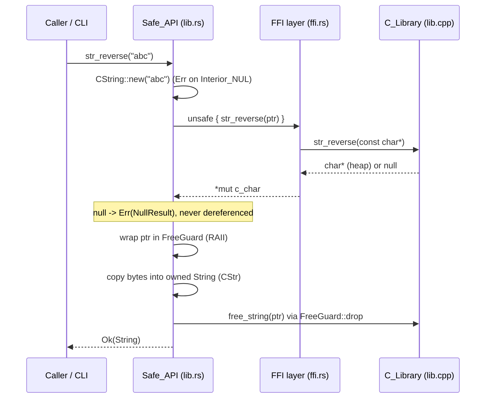
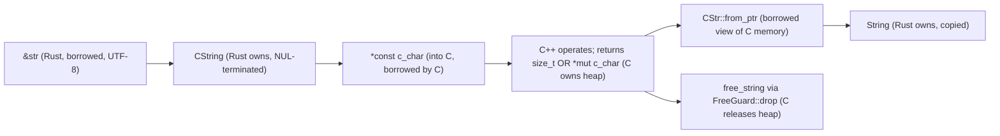

# Design Document

## Overview

This feature is a Rust crate that wraps a minimal C++ string-utilities library to
demonstrate safe cross-language interoperability (FFI). It implements **Option A** from
the evaluation: a string-utilities library (`str_length`, `str_reverse`, `count_vowels`,
`to_uppercase`, plus `free_string`). Option A was chosen over simpler numeric alternatives
because string operations force an honest demonstration of the hard part of FFI — **manual
heap memory management across a language boundary**. Two of the four operations return
freshly heap-allocated C strings that the caller must release, which lets the design show a
disciplined, leak-free ownership model rather than trivially copyable scalars.

The central design idea is a strict, one-directional layering that isolates all danger in a
single place:

- The **C++ layer** implements the utilities and exposes them through a C-compatible header
  (`extern "C"`), so symbol names are unmangled and `bindgen` can parse the interface.
- The **build layer** (`build.rs`) compiles the C++ into a static library with the `cc`
  crate and generates raw Rust FFI declarations from the header with `bindgen`.
- The **FFI layer** (`src/ffi.rs`) is the *only* module that contains `unsafe` code. It
  includes the generated bindings and nothing else policy-relevant.
- The **safe API** (`src/lib.rs`) wraps the FFI layer. No public signature contains the
  `unsafe` keyword. Every function takes `&str`, returns a `Result`, copies any
  C-allocated data into an owned Rust `String`, and frees the C allocation exactly once.
- The **error module** (`src/error.rs`) defines one isolated `Error` type describing the
  two failure modes (interior-NUL conversion failure and null/allocation-failure results).
- The **CLI demo** (`src/main.rs`) exercises the safe API from the command line.

The primary quality goal (from the requirements introduction) is a clean separation between
the `unsafe` FFI layer and the safe public API, with sound resource management (no leaks, no
undefined behavior) and thoughtful, `Result`-based error handling. Every design decision
below traces back to a specific acceptance criterion.

## Architecture

### Layered view

```mermaid
flowchart TD
    subgraph cpp["C++ layer (native)"]
        H["cpp/wrapper.h<br/>extern \"C\" declarations"]
        L["cpp/lib.cpp<br/>str_length, str_reverse,<br/>count_vowels, to_uppercase,<br/>free_string"]
        H -. declares .- L
    end

    subgraph build["Build layer — build.rs"]
        CC["cc::Build<br/>compile lib.cpp -> libstringutils.a"]
        BG["bindgen::Builder<br/>wrapper.h -> $OUT_DIR/bindings.rs"]
    end

    subgraph rust["Rust crate"]
        FFI["src/ffi.rs<br/>include! generated bindings<br/>(ONLY unsafe boundary)"]
        API["src/lib.rs — Safe_API<br/>str_length / count_vowels /<br/>str_reverse / to_uppercase<br/>(no unsafe in signatures)"]
        ERR["src/error.rs<br/>Error enum + Display + Error"]
        BIN["src/main.rs — CLI_Demo"]
    end

    subgraph docker["Docker layer"]
        DF["Dockerfile<br/>pinned Rust + Clang/LLVM + g++"]
        DC["docker-compose.yml<br/>one-command build + test"]
    end

    L --> CC
    H --> BG
    CC -->|static lib linked| FFI
    BG -->|bindings.rs| FFI
    FFI --> API
    ERR --> API
    API --> BIN
    DF --> DC
    DC -.runs.-> API
```

### Control and data flow for a string-returning call



### How the layering maps to SOLID (while staying idiomatic Rust)

The requirement is a *clean separation* between unsafe and safe code. SOLID is used here as
a lens, not as a mandate to introduce object-oriented scaffolding that Rust does not need:

- **Single Responsibility.** Each module has exactly one reason to change. The C++ layer
  owns the algorithms and native allocation. `build.rs` owns compilation and binding
  generation. `ffi.rs` owns the raw `unsafe` boundary. `lib.rs` owns the safe conversion
  and ownership discipline. `error.rs` owns the failure vocabulary. This is what makes
  "the only `unsafe` lives in one module" enforceable (Req 5.3).
- **Open/Closed.** New utilities are added by declaring them in the header, defining them in
  `lib.cpp`, and adding one safe wrapper — without editing existing wrappers.
- **Dependency Inversion (idiomatic reading).** The safe API depends on the *abstraction* of
  the FFI boundary (the generated function signatures), not on the C++ implementation
  details. The boundary is the seam.
- **Interface Segregation / isolated error type.** The `Error` type is a small, isolated
  enum in its own module; consumers depend only on the variants that concern them.

Deliberately **not** applied: no trait objects, no dependency-injection containers, no
builder patterns for the four functions. The functions are free functions returning
`Result`, which is the idiomatic Rust shape. Forcing OOP abstractions here would add
indirection without improving safety or clarity — an explicit design decision.

## Project Structure

```
rust-c-bridge/
├── Cargo.toml            # [lib] + [[bin]] + [build-dependencies] bindgen & cc
├── build.rs              # cc compile + bindgen generate; rerun-if-changed directives
├── cpp/
│   ├── wrapper.h         # extern "C" declarations (C_Header)
│   └── lib.cpp           # implementations (C_Library)
├── src/
│   ├── ffi.rs            # include! generated bindings — the only unsafe boundary
│   ├── error.rs          # Error enum, Display, std::error::Error, From<NulError>
│   ├── lib.rs            # Safe_API + internal helpers (#[cfg(test)] mod tests)
│   └── main.rs           # CLI_Demo binary
├── tests/
│   └── integration.rs    # correctness, edge cases, safety, property-based tests
├── Dockerfile            # pinned Rust + LLVM/Clang + g++
├── docker-compose.yml    # one-command build + test service
├── .dockerignore         # keep build context small (target/, .git, etc.)
└── README.md             # setup, build, usage, memory model, Docker, notes
```

### Cargo.toml shape

```toml
[package]
name = "rust-cpp-ffi-wrapper"
version = "0.1.0"
edition = "2021"

[lib]
name = "stringutils"
path = "src/lib.rs"

[[bin]]
name = "stringutils-cli"
path = "src/main.rs"

[build-dependencies]
bindgen = "0.69"   # exact minor pinned; provides CargoCallbacks + clang args
cc = "1.0"         # compiles C++ via the C++ toolchain

[dev-dependencies]
proptest = "1"     # property-based testing for the correctness properties
```

The crate is intentionally **both a library and a binary**. The library is the reusable,
testable artifact; the binary is the demo driver (Req 6). Keeping them in one crate means a
single `cargo build`/`cargo test` covers everything and the CLI links the exact same code
that tests exercise.

## Components and Interfaces

### C++ layer — `cpp/wrapper.h` and `cpp/lib.cpp`

The header declares every function with C linkage so name mangling is prevented and
`bindgen` sees plain C symbols (Req 2.1, 2.3, 2.4). It uses only FFI-compatible C types
(Req 2.2).

```c
/* cpp/wrapper.h */
#ifndef STRINGUTILS_WRAPPER_H
#define STRINGUTILS_WRAPPER_H

#include <stddef.h>   /* size_t */

#ifdef __cplusplus
extern "C" {
#endif

/* Length in bytes, excluding the terminating NUL. */
size_t str_length(const char *input);

/* Count of ASCII vowels (a,e,i,o,u, case-insensitive). */
size_t count_vowels(const char *input);

/* Newly heap-allocated, NUL-terminated reversed copy. NULL on allocation failure. */
char *str_reverse(const char *input);

/* Newly heap-allocated, NUL-terminated ASCII-uppercased copy. NULL on allocation failure. */
char *to_uppercase(const char *input);

/* Releases memory returned by str_reverse / to_uppercase. No-op on NULL. */
void free_string(char *s);

#ifdef __cplusplus
}
#endif

#endif
```

Design points, each traced to a criterion:

- **Counts return `size_t`** (non-negative by type). `str_length` returns the byte count
  before the NUL (Req 1.1, 1.7). `count_vowels` returns the vowel count over the same range
  (Req 1.3).
- **String returns are `char *`**, freshly heap-allocated and NUL-terminated, reversed or
  ASCII-uppercased over the bytes before the terminating NUL (Req 1.2, 1.4). Allocation is
  on the heap and ownership transfers to the caller (Req 1.6).
- **Allocation strategy.** `lib.cpp` allocates returned strings with `new char[n + 1]`; the
  reverse copies bytes in reverse order and the uppercase copies with ASCII case-folding.
  `free_string` releases with the matching `delete[]` (Req 1.10). Using `new[]`/`delete[]`
  consistently on both sides is what makes the allocator match — the crux of leak-free FFI.
- **Empty input.** Every string-returning function returns a newly allocated one-byte buffer
  holding only the terminating NUL (Req 1.8); `str_length` returns 0 (Req 1.7).
- **ASCII-only semantics.** `to_uppercase` and `count_vowels` operate on ASCII only; any
  byte greater than 127 passes through unchanged (Req 1.5). This is a documented limitation
  (Req 9.5).
- **Allocation failure.** If allocation fails, the function returns a null pointer and does
  not modify the input (Req 1.9). Implementation uses `new (std::nothrow) char[...]` so a
  failure yields `nullptr` rather than a thrown `std::bad_alloc` crossing the C boundary.
- **`free_string(NULL)` is a no-op** (Req 1.11) — a guarded `if (s) delete[] s;`.
- **Correspondence.** Every declared function is defined and vice versa (Req 2.4), and
  `free_string` accepts a pointer previously returned by either string-producing function
  (Req 2.5).

### Build script — `build.rs`

`build.rs` performs two jobs and fails the whole build if either fails (Req 4).

```rust
use std::env;
use std::path::PathBuf;

fn main() {
    // Rebuild triggers (Req 4.4, 4.5): one per C++ source + the header.
    println!("cargo:rerun-if-changed=cpp/lib.cpp");
    println!("cargo:rerun-if-changed=cpp/wrapper.h");

    // 1) Compile the C++ into a static lib and link it (Req 4.1, 4.3, 4.6).
    //    .cpp(true) selects the C++ compiler and links the C++ stdlib.
    cc::Build::new()
        .cpp(true)
        .file("cpp/lib.cpp")
        .include("cpp")            // include path so wrapper.h resolves (Req 4.2)
        .compile("stringutils");   // Cargo links libstringutils.a automatically

    // 2) Generate Rust FFI bindings from the C header (Req 3).
    let bindings = bindgen::Builder::default()
        .header("cpp/wrapper.h")
        .clang_arg("-x")           // parse the header as C++ (Req 3.1, 4.2)
        .clang_arg("c++")
        .allowlist_function("str_length")
        .allowlist_function("count_vowels")
        .allowlist_function("str_reverse")
        .allowlist_function("to_uppercase")
        .allowlist_function("free_string")
        .parse_callbacks(Box::new(bindgen::CargoCallbacks::new()))
        .generate()
        .expect("bindgen failed to parse cpp/wrapper.h"); // Req 3.4, 3.5, 3.6

    let out = PathBuf::from(env::var("OUT_DIR").unwrap());
    bindings
        .write_to_file(out.join("bindings.rs"))
        .expect("failed to write $OUT_DIR/bindings.rs"); // Req 3.3
}
```

- **`cc` configuration.** `.cpp(true)` compiles in C++ mode (Req 4.3) and arranges linkage
  of the C++ standard library; `.include("cpp")` supplies the include path so sources and
  header resolve without unresolved-include errors (Req 4.2). `.compile("stringutils")`
  emits `libstringutils.a` and emits the link directives so Cargo links it automatically
  (Req 4.1, 4.6). Any `cc` failure aborts the build with a non-zero status and surfaces the
  compiler/linker diagnostics (Req 4.7).
- **`bindgen` configuration.** One declaration is generated per header function (Req 3.1);
  the `-x c++` clang args make the C++ header parse cleanly; `allowlist_function` keeps the
  bindings tight to exactly the five functions so no stray system types leak in (supports
  Req 3.2). `CargoCallbacks` re-emits rerun-if-changed for headers bindgen pulls in.
- **Failure behavior.** `.generate().expect(...)` and `write_to_file(...).expect(...)` cause
  `build.rs` to panic, which Cargo reports as a non-zero build exit with the diagnostic
  message identifying the failing header (Req 3.4, 3.5, 3.6). No `bindings.rs` is written on
  parse failure because the write only runs after a successful `generate()`.

### FFI module — `src/ffi.rs`

This module is the single unsafe boundary. It does nothing but include the generated
bindings and document the boundary invariants.

```rust
//! Raw FFI bindings to the C++ string-utilities library.
//!
//! # Safety boundary
//! This module is the ONLY place that exposes the raw C symbols. Every item here is
//! `unsafe` to call. Callers (the safe API in `lib.rs`) are responsible for:
//! - passing valid, NUL-terminated `*const c_char` pointers,
//! - never dereferencing a returned null pointer,
//! - freeing every non-null returned pointer exactly once via `free_string`.
#![allow(non_upper_case_globals, non_camel_case_types, non_snake_case, dead_code)]

include!(concat!(env!("OUT_DIR"), "/bindings.rs"));
```

The generated file declares each function inside an `extern "C"` block as an `unsafe fn`
(Req 3.1, 3.2). No `unsafe` from this module escapes into a public signature (Req 5.3).

### Error module — `src/error.rs`

One small, isolated enum captures the two ways the pipeline can fail (Req 5.9).

```rust
use std::ffi::NulError;
use std::fmt;

#[derive(Debug)]
pub enum Error {
    /// The input `&str` contained an interior NUL byte and could not be
    /// converted to a C string. The FFI layer was not called. (Req 5.5)
    Conversion(NulError),
    /// A C_Library string-producing function returned a null pointer,
    /// indicating allocation failure. The pointer was not dereferenced. (Req 5.10)
    NullResult,
}

impl fmt::Display for Error {
    fn fmt(&self, f: &mut fmt::Formatter<'_>) -> fmt::Result {
        match self {
            Error::Conversion(e) => write!(f, "input contains an interior NUL byte: {e}"),
            Error::NullResult => write!(f, "C library returned null (allocation failure)"),
        }
    }
}

impl std::error::Error for Error {
    fn source(&self) -> Option<&(dyn std::error::Error + 'static)> {
        match self {
            Error::Conversion(e) => Some(e),
            Error::NullResult => None,
        }
    }
}

impl From<NulError> for Error {
    fn from(e: NulError) -> Self {
        Error::Conversion(e)
    }
}
```

- `Conversion` wraps the `std::ffi::NulError` returned by `CString::new` on interior NUL
  (Req 5.5). The `From<NulError>` impl lets the safe API use `?` on the conversion.
- `NullResult` represents a null return from a string-producing function (Req 5.10).
- `Display` + `std::error::Error` make it a first-class error usable with `?`, `Box<dyn
  Error>`, and standard tooling (Req 5.9).

### Safe API — `src/lib.rs`

Public signatures — none contains `unsafe` (Req 5.1, 5.2):

```rust
pub fn str_length(input: &str) -> Result<usize, Error>;
pub fn count_vowels(input: &str) -> Result<usize, Error>;
pub fn str_reverse(input: &str) -> Result<String, Error>;
pub fn to_uppercase(input: &str) -> Result<String, Error>;
```

Internal CString conversion helper (Req 5.4, 5.5):

```rust
use std::ffi::CString;

/// Convert a &str to a CString, mapping interior-NUL to Error::Conversion.
/// No `unsafe` is needed for this conversion.
fn to_cstring(input: &str) -> Result<CString, Error> {
    Ok(CString::new(input)?) // NulError -> Error::Conversion via From
}
```

RAII free-guard for returned `char*` (Req 5.7, 5.11) — the exactly-once-free mechanism:

```rust
use std::os::raw::c_char;

/// Owns a `*mut c_char` returned by the C_Library and guarantees it is freed
/// exactly once, on every return path (including early returns and panics),
/// via the C-provided `free_string`. Never call libc::free — the allocator
/// must match the C++ `new[]`/`delete[]` pair.
struct FreeGuard(*mut c_char);

impl Drop for FreeGuard {
    fn drop(&mut self) {
        // SAFETY: self.0 came directly from a C_Library string-producing
        // function; free_string is a no-op on null, so this is sound even if
        // construction guarded a non-null pointer. Called exactly once.
        unsafe { ffi::free_string(self.0) }
    }
}
```

The two length/count wrappers convert then call the FFI function and return the count
directly (no allocation crosses back, so no guard needed). The two string wrappers convert,
call the FFI function, check for null (returning `Error::NullResult` without dereferencing —
Req 5.10), wrap the non-null pointer in a `FreeGuard`, copy the bytes into an owned `String`
via `CStr` (Req 5.6, 5.8), and let the guard free the C allocation as the function returns
(Req 5.7, 5.11). Because the copy happens before the guard drops, the owned `String` never
borrows C memory — there is no dangling borrow, and any borrowed data would be lifetime-bound
to its source (Req 5.12). Each public function carries doc comments with a usage example
(Req 9.1) and documents the ASCII-only limitation and interior-NUL behavior (Req 9.5, 9.7).
Unit tests live in a `#[cfg(test)] mod tests` block (Req 7.8).

### CLI demo — `src/main.rs`

```rust
use std::process::ExitCode;

fn main() -> ExitCode {
    let mut args = std::env::args().skip(1);
    let input = match (args.next(), args.next()) {
        (Some(s), None) => s,                 // exactly one argument (Req 6.1)
        _ => {                                // zero or too many -> usage + non-zero (Req 6.3)
            eprintln!("usage: stringutils-cli <string>");
            return ExitCode::FAILURE;
        }
    };

    match run(&input) {
        Ok(()) => ExitCode::SUCCESS,          // all ops printed, zero status (Req 6.2)
        Err(e) => {                           // Conversion_Error -> message, no results (Req 6.4)
            eprintln!("error: {e}");
            ExitCode::FAILURE
        }
    }
}
```

- `run(&input)` invokes each of the four safe operations and prints a labeled line per
  result (length, vowels, reversed, uppercased), returning `Ok(())` after all succeed
  (Req 6.1, 6.2). Output format: one `key: value` line per operation.
- No argument (or more than one) prints usage to stderr and exits non-zero (Req 6.3).
- If any operation returns `Error::Conversion`, `run` short-circuits so no operation result
  is printed; `main` prints the error and exits non-zero (Req 6.4).

## Data Models

### Type flow across the boundary

There are no domain structs; the "data model" is the sequence of string representations as
data crosses the FFI seam.



- **`&str` → `CString`**: `CString::new` copies the bytes and appends a NUL; it fails with
  `NulError` on interior NUL (mapped to `Error::Conversion`, Req 5.5). Rust owns the
  `CString` for the duration of the call.
- **`CString` → `*const c_char`**: `as_ptr()` hands C a borrowed, read-only pointer valid
  for the call; the `CString` outlives the call so the pointer never dangles.
- **`*mut c_char` (return) → `String`**: the safe API copies the C bytes into an owned Rust
  `String` via `CStr`, then frees the C buffer. Borrowed `CStr` views never outlive the C
  allocation (Req 5.12).

### Ownership table

| Allocation                         | Allocated by | Owned by (until freed)     | Freed by                         | Criterion            |
|------------------------------------|--------------|----------------------------|----------------------------------|----------------------|
| Input `CString` buffer             | Rust         | Rust                       | Rust (dropped at scope end)      | 5.4                  |
| `str_reverse` return `char*`       | C++ (`new[]`)| C++ heap, held via FreeGuard | C++ `free_string` (`delete[]`) via FreeGuard::drop | 1.2, 1.6, 5.7, 5.11 |
| `to_uppercase` return `char*`      | C++ (`new[]`)| C++ heap, held via FreeGuard | C++ `free_string` (`delete[]`) via FreeGuard::drop | 1.4, 1.6, 5.7, 5.11 |
| Owned result `String`              | Rust (copy)  | Caller                     | Rust (caller drops)              | 5.6, 5.8             |
| `size_t` count returns             | n/a (by value)| n/a                       | n/a                              | 1.1, 1.3            |

The rule stated plainly for documentation (Req 9.4): **C++ allocates and C++ frees** every
returned string, using the matching `new[]`/`delete[]` allocator; **Rust copies** the bytes
into an `Owned_String` it hands to the caller. Rust never calls `libc::free` on a
C++-allocated pointer.

## Correctness Properties

*A property is a characteristic or behavior that should hold true across all valid
executions of a system — essentially, a formal statement about what the system should do.
Properties serve as the bridge between human-readable specifications and machine-verifiable
correctness guarantees.*

The following properties were derived from the acceptance-criteria prework. Redundant
criteria were consolidated: the length criterion (1.1) and its restatement (7.10) collapse
into one property; single-reverse correctness folds into the reverse involution; the >127
pass-through rule (1.5) is validated by the host-model comparisons for vowels and uppercase
because their generators include non-ASCII bytes. Criteria that are structural (linkage,
binding generation, build, API shape), boundary examples (empty input, `free_string(null)`),
or non-deterministic (allocation failure) are validated by unit/smoke/integration tests in
the Testing Strategy rather than by properties.

### Property 1: Length equals host byte length

*For any* NUL-free string `s`, `str_length(s)` returns `Ok(n)` where `n == s.as_bytes().len()`.

**Validates: Requirements 1.1, 1.7, 7.10**

### Property 2: Reverse is an involution

*For any* NUL-free string `s`, `str_reverse(str_reverse(s))` returns `Ok(s2)` with
`s2 == s`; and `str_reverse(s)` equals the host-side byte reversal of `s`.

**Validates: Requirements 1.2, 1.8**

### Property 3: Vowel count equals the host ASCII model

*For any* NUL-free string `s`, `count_vowels(s)` returns `Ok(n)` where `n` equals an
independent host-side count of ASCII vowels (`a e i o u`, case-insensitive), with bytes
greater than 127 never counted.

**Validates: Requirements 1.3, 1.5**

### Property 4: Uppercase equals the host ASCII model

*For any* NUL-free string `s`, `to_uppercase(s)` returns `Ok(u)` where `u` equals the
host-side ASCII-uppercase transform of `s` — ASCII lowercase letters are folded to uppercase
and every byte greater than 127 is left unchanged.

**Validates: Requirements 1.4, 1.5**

### Property 5: ASCII case round-trip

*For any* string `s` consisting only of ASCII lowercase letters, applying `to_uppercase`
then host-side lowercasing reproduces the original: `to_uppercase(s).map(|u| u.to_lowercase()) == Ok(s)`.

**Validates: Requirements 7.9, 1.4**

### Property 6: Interior NUL always yields a Conversion error

*For any* string that contains at least one interior NUL byte, every Safe_API function
returns `Err(Error::Conversion)` and does not call into the FFI layer.

**Validates: Requirements 5.5**

### Property 7: Repeated invocation never panics

*For any* sequence of at least 10,000 generated NUL-free inputs, repeatedly invoking each
Safe_API function completes without panicking and frees every C allocation exactly once
(observable as sustained execution with no abort and no leak growth).

**Validates: Requirements 7.6, 5.11**

## Error Handling

All fallibility is surfaced through `Result<T, Error>` (Req 5.9). There are exactly two
failure conditions, and both are handled before any unsound operation can occur.

| Failure condition | Where detected | Error variant / Result outcome | FFI called? | Pointer dereferenced? | Criterion |
|-------------------|----------------|--------------------------------|-------------|----------------------|-----------|
| Input `&str` has an interior NUL | `to_cstring` via `CString::new` | `Err(Error::Conversion(NulError))` | No | No | 5.5 |
| String-producing C fn returns null (alloc failure) | Safe API null check after FFI call | `Err(Error::NullResult)` | Yes | No — null checked first | 1.9, 5.10 |
| C++ allocation fails internally | C++ `new (std::nothrow)` | returns `nullptr` to Rust (becomes `NullResult`) | — | — | 1.9 |
| C++ compilation / link fails | `build.rs` (`cc`) | non-zero build exit, diagnostics surfaced, no artifact | — | — | 4.7 |
| Header cannot be parsed / type unmapped | `build.rs` (`bindgen`) | non-zero build exit, diagnostic names the header/type, no `bindings.rs` | — | — | 3.4, 3.5, 3.6 |

**Exactly-once free guarantee (Req 5.11).** Every non-null pointer returned by a
string-producing function is immediately moved into a `FreeGuard`. `FreeGuard`'s `Drop` impl
calls `free_string` exactly once when the guard leaves scope — on the normal return path,
on any early `?` return, and during unwinding if a panic occurs between construction and the
copy. Because the owned `String` is produced by copying *before* the guard drops, the freed
C memory is never observed after release. Rust never frees a C++ allocation with
`libc::free` or Rust's allocator; `free_string` (C++ `delete[]`) matches the `new[]` used to
allocate (Req 1.10). `free_string(null)` is a no-op, so the guard is sound regardless
(Req 1.11).

**CLI error handling (Req 6.3, 6.4).** Missing/extra arguments print usage to stderr and
exit non-zero. A `Conversion` error short-circuits before any operation result is printed;
the CLI prints the error to stderr and exits non-zero.

## Testing Strategy

Testing uses a **dual approach**: property-based tests verify the universal properties above
across many generated inputs, and example/unit/integration tests cover concrete scenarios,
boundaries, structural guarantees, and memory safety that are not expressible as
input-varying properties.

### Property-based tests (proptest)

- Library: **`proptest`** (a mature Rust PBT library) — not hand-rolled. It shrinks failing
  cases to minimal counterexamples.
- Each of Properties 1–7 is implemented by a **single** property test.
- Each test runs a **minimum of 100 iterations** (`proptest` default; configured explicitly
  to be at least 100, and Property 7's stress test uses at least 10,000).
- Generators produce NUL-free strings including ASCII, empty, single-character, special
  characters, and multi-byte / high-byte (>127) sequences, so Properties 3 and 4 exercise
  the `>127` pass-through rule (Req 1.5) and edge cases (Req 7.4).
- Each property test is tagged with a comment in the format:
  **`Feature: rust-cpp-ffi-wrapper, Property {number}: {property_text}`**.

| Property | What it validates | Requirements |
|----------|-------------------|--------------|
| P1 length == byte length | length correctness | 1.1, 1.7, 7.10 |
| P2 reverse involution | reversal correctness | 1.2, 1.8 |
| P3 vowel count == host model | vowel counting, >127 pass-through | 1.3, 1.5 |
| P4 uppercase == host model | uppercasing, >127 pass-through | 1.4, 1.5 |
| P5 ASCII case round-trip | ASCII case round-trip | 7.9, 1.4 |
| P6 interior-NUL -> Err | conversion-error path | 5.5 |
| P7 >=10,000 no panic | robustness + exactly-once free | 7.6, 5.11 |

### Example / unit tests (`#[cfg(test)] mod tests`, Req 7.8)

- Representative valid inputs produce expected output for each function (Req 7.1).
- Empty-string input: `str_length("") == 0`, `str_reverse("") == ""`, `to_uppercase("") == ""`,
  `count_vowels("") == 0` (Req 7.2, 1.7, 1.8).
- Single-character input for each function (Req 7.3).
- Special-character and multi-byte Unicode input (e.g. `"héllo 世界!"`) — verifies bytes >127
  pass through and no panic (Req 7.4).
- Interior-NUL input returns `Err(Error::Conversion)` for each function (Req 7.5, 5.5).
- Doctests: the usage example on each of the four public functions compiles and runs under
  `cargo test` (Req 9.1).

### Safety tests (integration, `tests/integration.rs`)

- **No-panic stress**: at least 10,000 repeated invocations of each function over varied
  inputs complete without panicking (Req 7.6) — this is the executable form of Property 7.
- **Leak detection**: a test performing many `str_reverse`/`to_uppercase` calls (each of
  which allocates in C++ and frees via `FreeGuard`) that can be run under **valgrind**
  (`valgrind --leak-check=full --error-exitcode=1 cargo test`) to confirm no memory is
  leaked (Req 7.7). The exactly-once free (Req 5.11) shows up as zero leaked bytes and zero
  invalid frees.

### Structural / smoke coverage

- Successful `cargo build` proves C linkage and header/library correspondence (Req 2.x),
  binding generation and type mapping (Req 3.1–3.3), and build integration (Req 4.1–4.6).
- The absence of `unsafe` in public signatures (Req 5.2, 5.3) is a compile-time property of
  the source, reinforced by keeping all `unsafe` inside `src/ffi.rs` and the `FreeGuard`
  drop.

### How Docker runs the suite

The Docker environment (below) compiles the crate and then runs `cargo test` in one
invocation (Req 8.2). A green run means all example, property, and safety tests passed
(Req 8.3); a compilation failure halts before tests (Req 8.5); a test failure surfaces the
failing cases and yields a non-zero exit (Req 8.6). Valgrind can be run in-container for the
leak test.

## Docker Design

A single, reproducible image provides the full toolchain so evaluators need nothing on the
host (Req 8).

- **Base image, version-pinned (Req 8.1).** Start from an exact Rust toolchain tag (e.g.
  `rust:1.79-bookworm`) and install pinned `clang`/`libclang` (LLVM, required by `bindgen`)
  and `g++` (the C++ compiler for `cc`) from the distribution's pinned package set. All
  three components — Rust, LLVM/Clang, C++ compiler — are pinned to exact versions so builds
  are reproducible. `LIBCLANG_PATH` is set so `bindgen` locates `libclang`.
- **Build + test in one invocation (Req 8.2, 8.3).** The image's default command runs
  `cargo build` followed by `cargo test`. Because `build.rs` compiles the C++ and generates
  bindings as part of `cargo build`, the single command exercises the entire pipeline. A
  fully successful compile-and-test run exits zero.
- **Compilation failure halts before tests (Req 8.5).** The build and test steps are
  chained with `&&`, so a non-zero `cargo build` (from C++ or crate compilation failure)
  stops the run before `cargo test` and propagates a non-zero exit.
- **Test failure surfaces cases (Req 8.6).** `cargo test`'s own output names the failing
  tests and returns non-zero, which the container propagates as its exit status.
- **`docker-compose.yml` (Req 8.4).** Defines one service (e.g. `test`) that builds the
  image and runs the build+test command, so `docker compose run --rm test` (or
  `docker compose up`) reproduces results with a single command and no host toolchain. The
  service's exit status is the suite's exit status.
- **`.dockerignore`.** Excludes `target/`, `.git/`, and other local artifacts to keep the
  build context small and builds deterministic.

## Key Design Decisions and Rationale

- **Option A (string utilities) over numeric utilities.** String returns require heap
  allocation and explicit cross-language deallocation, which is the substantive FFI risk
  worth demonstrating. Numeric-only utilities would hide the memory-management story.
- **RAII `FreeGuard` for exactly-once free.** Tying `free_string` to `Drop` guarantees the
  free happens on every return path — normal, early-`?`, and panic-unwind — exactly once,
  without scattering manual `free` calls. This directly encodes Req 5.7 and 5.11.
- **Copy-then-free ownership model.** Rust copies C bytes into an owned `String` and then
  frees the C buffer, so the public API returns memory Rust fully owns and no borrowed view
  ever outlives the C allocation (Req 5.6, 5.8, 5.12).
- **ASCII-defined semantics.** Uppercasing and vowel counting are defined over ASCII, with
  bytes >127 passing through unchanged (Req 1.5). This keeps the C++ simple and the behavior
  precisely specified; it is a documented limitation (Req 9.5).
- **Crate is both a library and a binary.** The library is the reusable, tested artifact;
  the binary is the demo (Req 6). One crate keeps build/test unified and ensures the CLI
  runs the exact tested code.
- **No unnecessary trait abstractions.** The four operations are free functions returning
  `Result` — the idiomatic Rust shape. SOLID goals (single responsibility, isolated error
  type, safe layer depending on the FFI abstraction) are met through module boundaries, not
  through trait objects or OOP scaffolding that would add indirection without safety value.
